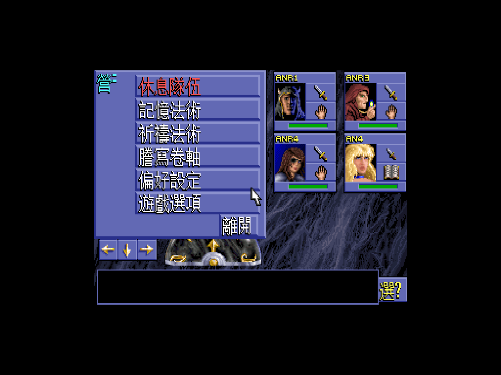
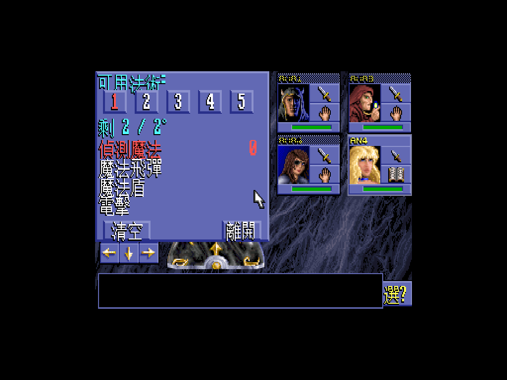
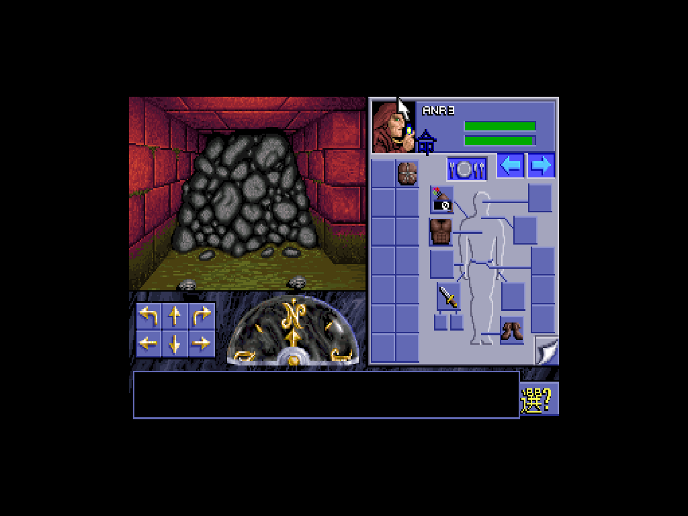
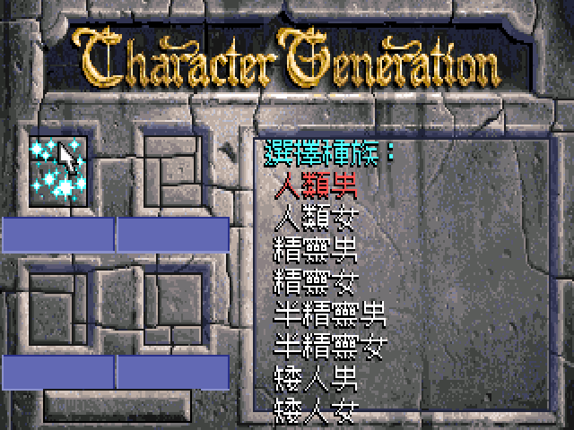
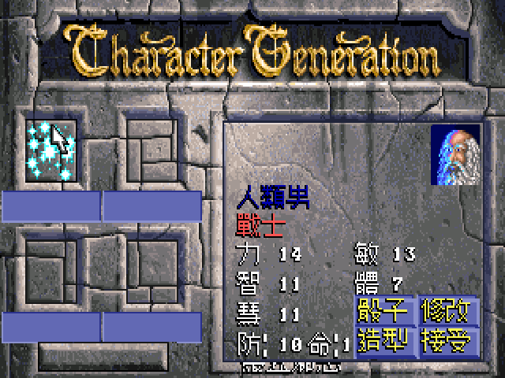
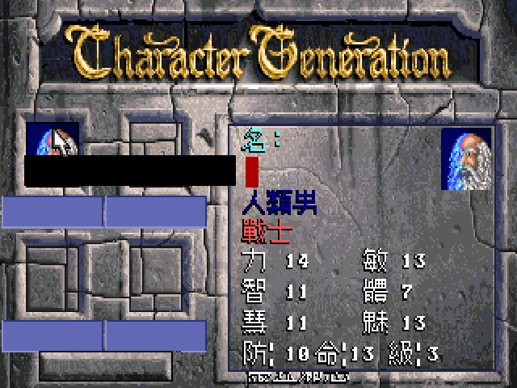

# EOB1 繁體中文化 (魔眼殺機 1) — ScummVM 路線

一份以 ScummVM 為基礎、把 1991 SSI/Westwood《Eye of the Beholder》(魔眼殺機 1) 改成繁體中文版的完整工作集。

不修原 DOS 二進位、不靠 DOSBox — 直接把 Big5 字模渲染與中文字串注入 ScummVM 的 KYRA engine，產出 Windows 原生 `scummvm.exe`。

**作者**: [wicanr2](https://github.com/wicanr2) — Embedded / Systems engineer
**Started**: 2026-05-23
**Repo**: https://github.com/wicanr2/eob1_cht
**Sister project**: [u6-cht](https://github.com/wicanr2/u6-cht) (Ultima VI 繁中化，同樣 ScummVM 路線)

## 關於《魔眼殺機 1》(Eye of the Beholder)

1991 年 Westwood Associates 開發、SSI (Strategic Simulations) 發行的**第一人稱即時格狀地牢探險 RPG**，採用 AD&D 第二版規則 (Advanced Dungeons & Dragons 2nd Edition) 與 Forgotten Realms (遺忘國度) 設定。引擎風格沿襲 1987 *Dungeon Master* (FTL Games)，但加入 AD&D 經典職業/種族/法術系統，是 1990s 早期 PC RPG 的里程碑。

### 故事背景

故事舞台在 Forgotten Realms 北方海岸城邦 **深水城 (Waterdeep)**。城下水道近期傳出邪惡騷動 — 怪物、卓爾 (Drow，黑暗精靈) 與更不祥之物的足跡。深水城議會 (Lords of Waterdeep) 召集一支 4 人冒險隊伍，授予「**委任狀及私掠許可**」(Commission and Letter of Marque)，賦予他們深入下水道的全權通行證，調查並消滅威脅。

冒險隊伍下井後，所有出口隨即在他們身後封閉 — 他們無路可退，只能往更深處探索 12 層地下迷宮:

1. **Waterdeep 下水道** (LEVEL 1-3) — 哥布林、史前怪物、墓地
2. **古老矮人殿堂** (LEVEL 4-6) — 重新發現的矮人王國 (Armun 族與 Teirgoh 國王)，被卓爾女祭司 **Shindia** 攻擊；矮人 **Keirgar 王子**被擄走
3. **卓爾領地** (LEVEL 7-9) — 黑暗精靈巡邏隊、奴隸交易、Shindia 的本營
4. **Beholder 巢穴** (LEVEL 10-12) — 終極反派 **Xanathar** (Forgotten Realms 中世襲性 Beholder 犯罪首領) 的住處，揭露他試圖挑撥矮人/卓爾互鬥以接管深水城的陰謀

### 遊戲機制亮點

- **AD&D 2e 職業/種族**: 戰士/遊俠/聖騎/法師/牧師/盜賊 + 雙職業/三職業組合 (e.g. 戰／法、戰法盜)
- **法術系統**: 法師/牧師每日記憶法術 (memorize)，含 magic missile, fireball, hold person, cure light wounds 等經典
- **即時戰鬥**: 點擊武器格觸發攻擊，配合移動/格擋的格狀策略
- **謎題與機關**: 牆面按鈕、傳送門、印記/鑰匙、矮人語符文
- **NPC 招募**: 沿路救活倒下的冒險者 (Anya, Beohram, Kirath, Ileira, Tyrra, Tod) 加入隊伍 (隊伍最大 6 人)

### 為何中文化

- EOB1 (1991) 從未有官方繁體中文版
- 隱月傳奇 (EOB2 ZH fan-translation) 於 1990s 中後期完成，**唯獨 EOB1 始終是空白**
- ScummVM (~2015 起) 將原 DOS 二進位逆向重寫為跨平台 C++ 引擎，為現代 OS 上的中文化提供新路徑 — 不需破解原 EXE / 不需 DOSBox 模擬器
- 本專案承接 [u6-cht](https://github.com/wicanr2/u6-cht) (Ultima VI 繁中化) 的**顯示時查表轉化** (Plan B) 方法論

### 本作 NPC 簡介

詳完整對話索引: [translations/dialogue.md](translations/dialogue.md)

#### 反派陣營

| NPC | 身份 | 出處 |
|---|---|---|
| **Xanathar** | Beholder (深淵之眼)、犯罪集團首領、本作 BOSS | D&D Forgotten Realms 世襲性 Beholder 頭銜，EOB1 為首次數位遊戲化 (1991)，2017 年 D&D 5e *Xanathar's Guide to Everything* 規則書再度沿用 |
| **Shindia** | 卓爾女祭司 (Drow priestess)，Xanathar 爪牙 | EOB1 原創。卓爾為 D&D 設定中崇拜蜘蛛女神 Lolth 的地底黑暗精靈，女祭司階層為其社會中樞 |

#### 矮人盟友 (Armun's Clan)

崇拜矮人主神 **Moradin** (D&D 經典「鍛造神」)。

| NPC | 身份 |
|---|---|
| **Armun** | 矮人代言人，遠征隊領袖 — entry [4] 揭露族史 (從深水城底地獄地洞展開重返之旅) |
| **King Teirgoh** | 矮人國王，在 Shindia 攻擊中重傷昏迷，需矮人解毒藥水救醒 |
| **Prince Keirgar** | 矮人王子，被擄至卓爾領地 — entry [27] 揭露 Xanathar 真正陰謀 |
| **Taghor** / **Dorhum** | 可加入隊伍的矮人戰士 |

#### 可招募 NPC (用 Resurrection / Raise Dead 救活)

EOB1 經典設計 — 地牢中埋藏 5 具前任冒險者屍體，玩家可選擇復活並招募 (隊伍可達 6 人)。每位 NPC 個性鮮明:

| NPC | 職業 | 個性側寫 |
|---|---|---|
| **Anya** | 戰士 | 復活後困惑，誓為同伴復仇 |
| **Beohram** | 戰士 (深水城 City Watch) | 衛隊獨行調查 Xanathar 失敗陣亡的勇士 |
| **Kirath** | 盜賊 | 玩世不恭，為金子與魔法物品冒險 |
| **Ileira** | 牧師修女 | 光明信仰，喜悅加入 |
| **Tyrra** | 女戰士 | 嘲諷玩家但仍簽訂契約式合作 |
| **Tod** | 半身人盜賊 (Halfling，D&D 版的 Hobbit) | 跌入下水道後迷失，自介為「正經冒險家」 |

#### 派系背景

**Lords of Waterdeep (深水城諸領主)**: Forgotten Realms 設定中深水城的領導集團 — 由匿名 「Masked Lords」 組成的議會制度，是該城邦真正的統治者 (非 Westwood 原創)。在 EOB1 中委派玩家隊伍 (透過 Commission and Letter of Marque 委任狀) 調查下水道威脅。後續被 *Forgotten Realms* 小說、規則書、與 *Lords of Waterdeep* (2012 桌遊) 多次重現。

## 現況一句話

**主選單、角色生成、CAMP、屬性表、咒語表、物品名稱、NPC 對話、文件與謎語、最終劇情全中文。** 仍有部分 LEVEL.INF script-embedded 動作訊息 (e.g. "going up...", "appears jammed") 為英文，iter10 用 **display-time substitution table** 處理 (參考 u6-cht 顯示時查表方案)。

雙擊 `win64-build/啟動.bat` 即玩 (Win10/11 Win64 native, 不需 SteamLibrary)。

### 字模兩種版本（iter27 起）

| 版本 | scummvm.exe engine load | ceob.pat | 字模來源 | 適合 |
|---|---|---|---|---|
| **15×15** | 15 | 15-row × 14-vis col | Unifont 16×16 bicubic resample | 與 ASCII PCBIOS Tall 15-tall **完全對齊行高**，UI layout fit 佳 |
| **16×16** | 16 | 16-row × 16-vis col | Unifont 16×16 原生 | 字模最完整、Unifont 原始風格 |

兩版可共存：`dist/EOB1-CHT-15x15/` 與 `dist/EOB1-CHT-16x16/` 各自獨立資料夾，包含獨立 scummvm.exe + 各自 ceob.pat + 完整 game files + 啟動.bat。

## Screenshots

### In-Game (16×16 字模, iter27)

字模從 Unifont 16×16 為基底，配 PIL bicubic 重採樣到適合尺寸 (15×15 / 16×16 兩版可選)。


**CAMP 選單** — 營：休息隊伍/記憶法術/祈禱法術/謄寫卷軸/偏好設定/遊戲選項/離開 + 右側 portrait 4 角色


**法術書** (右鍵法書 ITEM 或 CAMP→記憶法術) — 可用法術 + 1-5 spell levels + 偵測魔法/魔法飛彈/魔法盾/電擊 + 剩餘可記憶數


**Inventory** — 右側角色物品欄 (頭盔/胸甲/法書/武器/靴等格位)

### 早期 iter1-iter6 修復記錄


**Fix B**: 選擇種族 / 職業 / 陣營 menu — 全中文 + title y=65


**Fix A + Fix D**: 屬性 2-col layout (力/敏 智/體 慧/魅 + 防/命/級) + 動作按鈕 (骰子/修改/造型/接受)


**Fix E + Fix F**: 名字輸入欄無殘留 + 多職業全形斜線 (戰／法)

### Iter 演進記錄

完整 50+ 截圖在 [test-reports/screenshots/](test-reports/screenshots/)，命名 `iter{N}-*` 對應 iter1~iter6 的測+修+驗證循環。

## 中文化進度 (累計 9 個 iter)

| 區塊 | 狀態 | 細節 |
|---|---|---|
| **CharGen 介面** | ✅ 全翻 | 種族/職業/陣營/屬性 menu + 動作按鈕 (骰子/修改/造型/接受) + 名字輸入 |
| **CharGen stats 2-col layout** | ✅ Fix A | 力/敏 智/體 慧/魅 + 防/命/級 |
| **In-game 角色資訊 panel** | ✅ Fix I | 同 2-col layout，借用 EOB2 ZH `_guiSettingsDOS_ZH` |
| **法術 panel (記憶/祈禱/卷軸)** | ✅ Fix H | `_bookFont = FID_CHINESE_FNT` 字形一致 |
| **CAMP menu** | ✅ | 休息隊伍/記憶法術/祈禱法術/謄寫卷軸/偏好設定/遊戲選項/離開 |
| **物品名稱 (95 項)** | ✅ iter7 | 詳 [translations/items.md](translations/items.md) |
| **NPC 對話 / 文件 / 謎語 (51 項)** | ✅ iter9 | 詳 [translations/dialogue.md](translations/dialogue.md) — Tod / Armun / Xanathar / 委任狀 / 4 謎語 / 最終劇情 |
| **動作訊息 (LEVEL.INF script)** | 🚧 部分規劃 | 詳 [translations/level_messages.md](translations/level_messages.md) — 168 strings 抽出，patcher 未 ship |
| **字模 (ceob.pat)** | ✅ ship | 16×12 hybrid — EOB2 CHINFONT 解密 + BoutiqueBitmap9x9 fallback，13,751 字 |
| **portable bundle** | ✅ iter4 | `win64-build/` 自含遊戲檔，不依賴 SteamLibrary |
| **跨平台 crash 修復** | ✅ iter5 | 3 個 array OOB gate (Linux glibc 容忍但 Windows MinGW crash) |

## 挖掘出來的原始內容 (映射到中文版)

### 物品 (EOBDATA6.PAK / ITEM.DAT, 95 項)
工具/武器/防具/魔法/任務道具，含 Westwood 具名魔法武器 (Severious / Guinsoo / Slasher / Backstabber / Flicka / Slicer / Night Stalker / Drow Cleaver) — 詳 [translations/items.md](translations/items.md)

### 對話與敘述 (EOBDATA3.PAK / TEXT.DAT, 51 項 16,105 bytes)
**NPC 重要劇情**:
- Tod (半身人盜賊) / Armun (矮人代言人) / Prince Keirgar / King Teirgoh / Shindia (卓爾女祭司) / Xanathar (Beholder 終極反派)
- 5 個可招募 NPC: Anya / Beohram / Kirath / Ileira / Tyrra (用 Cure Light Wounds / Resurrection 復活後加入)
- Armun 族史長篇 (原文 1813 bytes，中譯 654 bytes)
- Xanathar 自介 + 黑袍爪牙揭露計畫

**文件**:
- 委任狀及私掠許可 (Commission and Letter of Marque) — 玩家撿到的紙卷
- 4 個 parchment 謎語 (寶石/矮人項鍊/球/Beholder 弱點)

**最終劇情**: Xanathar 戰敗後，深水城諸領主歡迎 + 矮人王國感念

詳完整中譯: [translations/dialogue.md](translations/dialogue.md)

### LEVEL.INF 動作訊息 (12 個關卡, 168 strings)
"going up..." / "you can't go that way." / "the lock has been picked!" / "appears jammed" / 等。多為短訊息，可 in-place patch (中文 ≤ 英文 bytes 限制)。長度受限導致部分需要簡潔翻譯。

詳: [translations/level_messages.md](translations/level_messages.md)

## 目錄

```
eob1_cht/
├── README.md                    本檔
├── 中文化心得.md                  從 0 到 100 的逆向心路歷程
├── translations/                 ⭐ 翻譯內容索引 (索引+中譯，原文摘要 only)
│   ├── README.md                 翻譯類別總覽 + 工具鏈
│   ├── items.md                  95 物品名 中譯
│   ├── dialogue.md               51 NPC 對話/文件/謎語 中譯
│   └── level_messages.md         LEVEL.INF 動作訊息中譯
├── scummvm-source/              ScummVM 完整源碼 (含我們的修改)
├── win64-build/                  Portable Win64 bundle
│   ├── scummvm.exe              MinGW-w64 cross-compile (含 Fix A-I)
│   ├── SDL2.dll
│   ├── 啟動.bat                 cp950 + CRLF 雙擊執行
│   └── game/                    遊戲檔 (KYRA.DAT + ceob.pat 追蹤；原版 PAK/EXE 不入 git)
│       ├── KYRA.DAT             含 95 物品 + 全 GUI 中文字串
│       ├── ceob.pat             16×12 Big5 字模
│       ├── TEXT.DAT             ⭐ 自製 — 含 51 個全中文 NPC 對話/文件 (覆寫 PAK 內版本)
│       └── (其他原版 game files 不入 git，需 user 自備)
├── tools/                       Python build/translation scripts (WSL python3 跑)
├── wsl-scripts/                 WSL build helper
├── skill/                       Claude Code skill
├── agents/                      Claude Code agent 定義 (game-tester / ux-designer / developer)
├── test-reports/                Game-tester agent 產出 + 截圖
├── design-reviews/              UX-designer + developer agent 產出
│   ├── applied-iter1.md         Fix A/B/C
│   ├── applied-iter3.md         Fix D/E (BUG-003/013)
│   ├── applied-iter4.md         Fix F (multi-class slash) + portable + .bat 雙雷
│   ├── applied-iter5.md         Fix G/G2 (geometry + 3 OOB crash)
│   ├── applied-iter6.md         Fix H (_bookFont) + Fix I (in-game stats layout)
│   ├── bug-009-analysis.md      CAMP `營：` layout 分析
│   ├── character-info-layout-design.md
│   └── kSpecial-chinese-fan-design.md
└── docs/
    ├── architecture.md
    ├── future-work.md
    ├── pitfalls.md              踩過的雷 (WSL build / .bat 編碼 / 跨平台 OOB)
    └── lessons-learned.md       9 個 iter 蒸餾的 8 條心得
```

## 快速開始 (玩遊戲)

### 已自備 EOB1 安裝

1. Copy 你的 EOB1 ENG 遊戲檔到 `win64-build/game/` (見 [game/README.md](win64-build/game/README.md))
2. 雙擊 `win64-build/啟動.bat`

### 沒有 EOB1?

請從 Steam 購買 "Forgotten Realms: The Archives — Collection One" 取得合法授權。

## 開發 (改翻譯 / 字模 / engine 行為)

**所有 binary manipulation 工具皆從 WSL Ubuntu-22.04 跑**，避免 Windows Defender / AV heuristic scan 誤判:

```bash
# 跑翻譯生成
wsl.exe -d Ubuntu-22.04 -- python3 /mnt/d/03_game_tmp/eob1_cht/tools/gen_text_dat_v2.py

# 重 build KYRA.DAT
wsl.exe -d Ubuntu-22.04 -- bash /mnt/d/03_game_tmp/eob1_cht/wsl-scripts/wsl_rebuild_kyradat.sh

# 重 build scummvm.exe (Win cross)
wsl.exe -d Ubuntu-22.04 -- bash /mnt/d/03_game_tmp/eob1_cht/wsl-scripts/wsl_build_mingw.sh
```

詳工具鏈見 [translations/README.md](translations/README.md)。

## ScummVM 引擎改動摘要 (累計 11 個 Fix)

| Fix | iter | 檔案 | 解決 |
|---|---|---|---|
| A | 1 | `chargen.cpp:1300` | EOB1 ZH stats 2-col layout (BUG-002 blocker) |
| B | 1 | `chargen.cpp:800/842/919` | 三個 CharGen menu title y=65 (BUG-001) |
| C | 1 | `eobcommon.cpp:613` | `_invFont1` 回 FID_6_FNT (BUG-004 portrait names) |
| D | 3 | `chargen.cpp:604` | EOB1 ZH 也走 `_chineseButtonExtraData` overlay (BUG-003 action buttons) |
| E | 3 | `chargen.cpp:772` | Name input gate + fillRect 清殘留 (BUG-013) |
| F | 4 | `eob1_dos_chinese.h` | Multi-class strings 全形斜線 ／ (BUG-007) |
| G | 5 | `gui_eob.cpp:1576-1580` | 5 input/dialog geometry 常數 gate 放寬 |
| G2 | 5 | `gui_eob.cpp:186/224/425` | 3 處 array OOB read gate 到 `GI_EOB2` (Windows-only crash) |
| H | 6 | `eobcommon.cpp:615` | `_bookFont` 加 FID_CHINESE_FNT chain (法術 panel 字形一致) |
| I | 6 | `eob.cpp` + `eob.h` + `staticres_eob.cpp` | 新增 `_guiSettingsVGA_ZH` (in-game stats panel 2-col) |
| J | 7 | `games.cpp` + `resources.cpp` + 2 個 *.h | `kEoB1ItemNames` DOS providers (EN extract + ZH 95 翻) |

Pattern: 多個 fix 同模 — `GI_EOB2 && ZH_TWN` gate 放寬到 `ZH_TWN`，把 EOB2 上游已 ship 多年的 ZH 路徑開放給 EOB1。

## 字模

`ceob.pat` 是 **hybrid** 字模:
- 12,811 字從 EOB2 (隱月傳奇) `CHINFONT.FNT` 解密後 crop 成 16×12
- 940 字從 BoutiqueBitmap9x9 TTF 渲染到 12px 補缺 (覆蓋 EOB2 沒有的字)
- 總 13,751 字 / 357 KB

格式 = ScummVM `Big5Font::loadPrefixedRaw`: `[2-byte BE codepoint][2*height bytes bitmap]...0xFFFF`

## 翻譯來源

- **CharGen / Menu 字串**: 源自前期 EOB1 EXE patch 專案的 `full_patches.json` (402 條原始 byte-offset 翻譯)，自動轉成 `tools/gen_eob1_chinese.py` 內的 ZH provider
- **物品名稱 (iter7)**: 從 `EOBDATA6.PAK` 的 `ITEM.DAT` 抽 95 EN names，依 1990s AD&D 2e 中文化慣例翻譯
- **NPC 對話/文件 (iter9)**: 從 `EOBDATA3.PAK` 的 `TEXT.DAT` 抽 51 條，全翻
- **LEVEL.INF 動作訊息 (iter10+)**: 從 12 個 `LEVEL{1-12}.INF` 抽 168 ASCII strings，目前部分規劃

## License

- ScummVM source: GPLv3+ (上游 license)
- 我們的 patches (engine + ZH provider strings + Python tools): GPLv3+
- BoutiqueBitmap9x9 字模: OFL 1.1
- EOB2 CHINFONT.FNT 字模: SSI 1993 中文版資產，**個人非商業用途下保留**，重新發布需自備 EOB2 中文版授權

**版權聲明**: 原 EOB1 (Westwood/SSI 1991) 之遊戲執行檔、PAK、ITEM.DAT、TEXT.DAT、LEVEL.INF 等內容**不入此 repo**。執行本中文化需 player 自備合法 EOB1 安裝 (建議 Steam "Forgotten Realms: The Archives — Collection One")。

## 這個 repo 在哪

https://github.com/wicanr2/eob1_cht

clone:
```bash
git clone https://github.com/wicanr2/eob1_cht.git
```

## 還沒做的

詳 [docs/future-work.md](docs/future-work.md):

| 項目 | 狀態 | 解法概念 |
|---|---|---|
| 角色名輸入 IME (注音) | 未動 | EOB2 CHINFONT.COD 結構非標 + 需寫 ScummVM IME widget |
| 過場 intro narration | 未動 | TITLE.CPS / ORB.CMP 等 baked image |
| 怪物名 | 未動 | 同物品名路徑 — 加 DOS provider 即可 |
| LEVEL.INF 完整翻譯 | 部分規劃 (iter10) | scan 完，patcher 未 ship |
| BUG-009 / BUG-014 / 字模 glyph polish | 已分析 | 詳 design-reviews/ |

## 設計理念 — 顯示時查表轉化 (Display-Time Substitution)

承接 [u6-cht (Ultima VI 繁中化)](https://github.com/wicanr2/u6-cht) 的核心方法論:

> **不改原版資料檔，而是在引擎渲染字串前查表替換**

iter1~9 對 KYRA.DAT 靜態字串、`TEXT.DAT` 對話、`ITEM.DAT` 物品名 — 都是「**換掉資料**」路線 (改 provider 內容 / 重生 KYRA.DAT)。但 LEVEL.INF script-embedded 動作訊息卡在「中文 cp950 2-bytes 比 ASCII 1-byte 長，撐爆 bytecode offset」的限制。

**Solution (iter10)**: hook ScummVM 的 text-display 函式，在 `printMessage` / `printDialogueText(const char*)` 入口處做 EN→ZH 查表 — 同 u6-cht 8 個 ScummVM hook 的模式。優點:
- ✅ 不動 LEVEL.INF bytecode → bytecode offset 100% 維持
- ✅ ZH 可任意長度 (不受原 EN bytes 限制)
- ✅ 移植容易 — 只是 C++ string map + 一個 lookup 函式
- ✅ 同個 hook 也能蓋 dynamic 場景 (e.g. NPC 動態生成字串、戰鬥訊息)
- ❌ 需要建 EN→ZH 完整對照表 (但 scan_level_inf.py 已先抽出 168 strings)

## 致謝

### 工具與 codebase
- **[ScummVM](https://www.scummvm.org/)** 團隊 — engine 與 cross-platform 基礎建設、Big5Font 支援、KyraEngine
- **[隱月傳奇 (EOB2 ZH fan-translation)](https://www.bahamut.com.tw/)** — `CHINFONT.FNT` 字模來源，含 12,811 個 16×14 Big5 glyph；以及上游 EOB2 ZH 既有的 `_guiSettingsDOS_ZH` / `_chineseButtonExtraData` 等 layout 與字串覆寫機制 (iter1/3/5/6 的 Fix A/B/D/E/G/I 模式皆出自此)
- **[BoutiqueBitmap9x9](https://github.com/scott0107000/BoutiqueBitmap9x9)** TTF — 補 EOB2 沒有的字 (940 字)，OFL 1.1
- **1990s 中文 D&D / AD&D RPG fan 圈** — 翻譯術語慣例 (戰士/法師/牧師/盜賊/長劍/...)

### 姊妹專案 / 同類技術
- **[u6-cht](https://github.com/wicanr2/u6-cht)** — Ultima VI 繁中化，**顯示時查表轉化** (Plan B) 的原始 codebase
- **[scummvm](https://github.com/wicanr2/scummvm/tree/eob1-cht-fan-translation)** — 我們的 ScummVM fork branch (含 iter1-9 全部 11 個 Fix)

### Co-author (AI-assisted development)
本中文化專案 9 個 iter 全程用 **[Claude Code](https://claude.com/claude-code)** + 多個 sub-agent (game-tester / ux-designer / developer / crash-investigator) 完成測+修+驗證迴圈:
- **game-tester agent**: WSL Xvfb headless 跑 scummvm，截圖 50+ 張，分類 13 個 bug
- **ux-designer agent**: 讀 test report 寫 design review (含 Fix B/D/E/G/G2/I 完整設計文件)
- **developer agent**: 套 design review 修源碼 + WSL build + 處理跨 Win64-build clone 同步問題

完整 iter 演進記錄: [design-reviews/](design-reviews/) + [docs/lessons-learned.md](docs/lessons-learned.md)

### Reverse engineering 工作
- `EOBDATA*.PAK` Westwood PAK 解析 (Python port from ScummVM resource_intern.cpp)
- `TEXT.DAT` LE-u16 offset-table 字串格式 (從 text_rpg.cpp:545 推導)
- `ITEM.DAT` 14-byte EoBItem struct + 35-byte name string (從 items_eob.cpp:40-53 推導)
- `ceob.pat` Big5Font::loadPrefixedRaw 格式: `[BE codepoint][2*height bitmap bytes]...0xFFFF`
